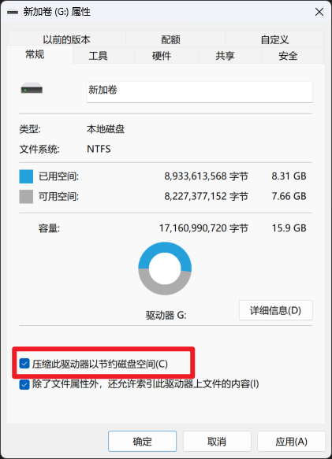

# FFXIV 环境配置工具

> 注意：游戏中会频繁对U盘或移动硬盘进行读写操作，若性能不足可能导致游戏频繁卡顿，**强烈建议使用移动硬盘或使用固态颗粒的U盘部署此工具！**

这是一个用于快速配置和卸载 XIVLauncherCN 游戏环境的批处理脚本工具集，用于在网吧等特定环境持久化保存游戏数据，避免每次重复配置。

## 使用说明

### 准备工作

> 注意：**此操作只需要执行一次！**

> 初始化时请保持稳定的网络连接，必要时开启魔法

1. 【可选】对于空间不足的U盘或移动硬盘，勾选“压缩此驱动器以节约磁盘空间”

2. 下载脚本，解压到U盘或移动硬盘根目录
3. 启动初始化脚本FFXIV_Init.bat，根据内容提示操作。

### 文件结构
```text
X:\  U盘或移动硬盘根目录
├── FFXIV_Setup.bat  安装脚本
├── FFXIV_Uninstall.bat  卸载脚本
├── FFXIV_Init.bat  初始化脚本
├── XIVLauncherCN\  XIVLauncher安装目录
├── ACT ACT安装目录
└── pre\
    ├── FINAL FANTASY XIV - A Realm Reborn\  游戏配置目录
    ├── XIVLauncherCN\  XIVLauncherCN配置目录
    ├── mods\  mod目录
    ├── VC_redist.x64.exe  VC依赖包
    └── windowsdesktop-runtime-8.0.21-win-x64.exe  dotNet依赖包
```

### 运行顺序

1. 先运行 FFXIV_Setup.bat 进行配置
2. 需要卸载时运行 FFXIV_Uninstall.bat
3. 当U盘或移动硬盘空间不足时可运行清理脚本 FFXIV_Clean.bat 释放空间
